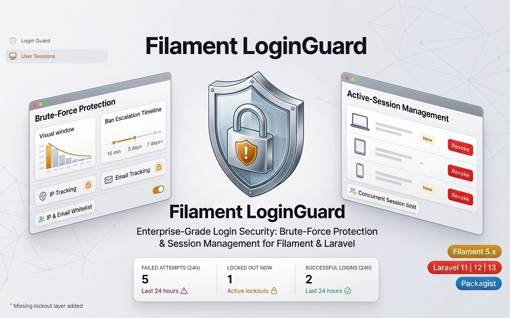
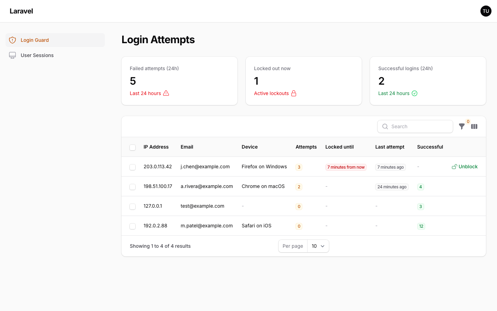
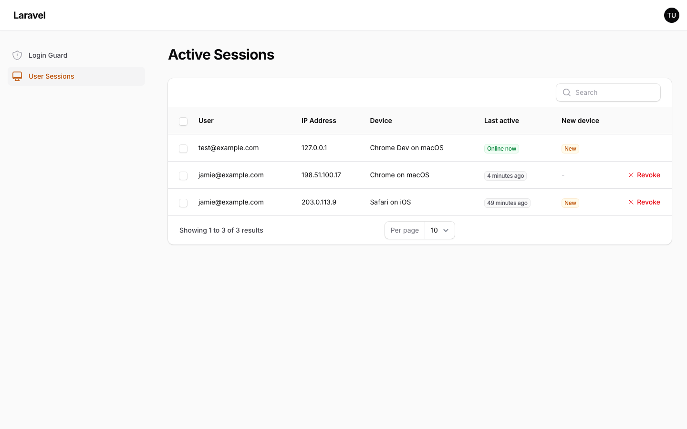

<a href="https://github.com/solutionforest/filament-loginguard" class="filament-hidden">

</a>

<p align="center" class="flex items-center justify-center">
    <a href="https://filamentphp.com/docs/5.x/panels/installation">
        
    </a>
    <a href="https://laravel.com/docs">
        
    </a>
    <a href="https://packagist.org/packages/solution-forest/filament-loginguard">
        
    </a>
    <a href="https://github.com/solutionforest/filament-loginguard/actions?query=workflow%3Atests+branch%3A5.x" class="filament-hidden">
        
    </a>
    <a href="https://github.com/solutionforest/filament-loginguard/actions?query=workflow%3Afix-code-style+branch%3A5.x" class="filament-hidden">
        
    </a>
    <a href="https://packagist.org/packages/solution-forest/filament-loginguard">
        
    </a>
</p>

<h1 style="font-size:2em; font-weight:bold; display:block; margin:0.67em 0;">Filament LoginGuard</h1>

Enterprise-grade login security for Filament and Laravel — persistent brute-force protection, escalating IP and email lockouts, and active-session management.

> [!NOTE]
> Filament already throttles its login page at 5 attempts per minute per IP. This package adds the missing **lockout layer** on top of that: persistent tracking, escalating bans, per-email protection and an admin UI.

## Features

- 🔒 **Brute-Force Protection**
  - 📦 Persistent per-IP/email attempt tracking
  - 📈 Escalating IP & email lockouts
  - 🕸️ Cross-email (per-IP) and cross-IP (per-email) aggregation
  - 🧠 Attempt decay window
  - 🎯 IP & email whitelists
  - 🔔 Administrator lockout notifications (cooldown + queue support)
- 👥 **Session Management**
  - 🖥️ Active-session listing with "last active" state
  - 🆕 New-device detection with optional email alert
  - 🔒 Concurrent-session limits with oldest-first eviction
  - 🔄 One-click session revoke
- 🧰 **Filament Management Interface**
  - 📋 Login Attempts page — inspect & unblock recorded attempts
  - 📊 Failed-attempts / lockout stats widget
  - 🛡️ Gate-based per-page authorization

<div class="filament-hidden">

## Compatibility

| Requirement | Version |
|-------------|---------|
| PHP         | 8.3+    |
| Laravel     | 11, 12 or 13 |
| Filament    | 5.x (≥ 5.6.5, Livewire 4) |

> Earlier 5.x releases have known security advisories; require at least Filament 5.6.5.

<b>Table of Contents</b>

- [Features](#features)
- [Compatibility](#compatibility)
- [Installation](#installation)
  - [1. Install the Package](#1-install-the-package)
  - [2. Publish the Config and Migrate](#2-publish-the-config-and-migrate)
  - [3. Register the Admin Pages](#3-register-the-admin-pages)
- [How it works](#how-it-works)
- [Session management](#session-management)
- [Configuration](#configuration)
- [Maintenance](#maintenance)
- [Testing](#testing)
- [Changelog](#changelog)
- [Contributing](#contributing)
- [Security Vulnerabilities](#security-vulnerabilities)
- [Credits](#credits)
- [License](#license)

</div>

## Installation

### 1. Install the Package

You can install the package via composer:

```bash
composer require solution-forest/filament-loginguard
```

### 2. Publish the Config and Migrate

Migrations are loaded automatically, so you only need to publish the config file and run `migrate`:

```bash
php artisan vendor:publish --tag="filament-loginguard-config"
php artisan migrate
```

Or run the interactive install command, which does all of the above:

```bash
php artisan filament-loginguard:install
```

Optionally, you can publish the views and translations using:

```bash
php artisan vendor:publish --tag="filament-loginguard-views"
php artisan vendor:publish --tag="filament-loginguard-translations"
```

### 3. Register the Admin Pages

To enable the **admin pages** (Login Attempts: view / unblock recorded attempts; User Sessions: list / revoke active sessions), register the plugin in your panel provider, e.g. `app/Providers/Filament/AdminPanelProvider.php`:

```php
use SolutionForest\FilamentLoginGuard\FilamentLoginGuardPlugin;

public function panel(Panel $panel): Panel
{
    return $panel
        // ...
        ->plugin(FilamentLoginGuardPlugin::make());
}
```

The core protection works **without** registering the plugin — only the admin pages need it. Each page can also be disabled independently via `pages.attempts.enabled` / `pages.sessions.enabled`.

## How it works

The package listens to three Laravel auth events, so it protects **every** login flow in your app (Filament panels, Fortify, custom controllers):

| Event | Action |
| --- | --- |
| `Illuminate\Auth\Events\Attempting` | If the IP or email is currently locked out, a `ValidationException` with the lockout message is thrown before any credential work happens. |
| `Illuminate\Auth\Events\Failed` | The failure is recorded for the (IP, email) pair. When the threshold is reached, the IP and/or email is locked out and admins are notified by email. |
| `Illuminate\Auth\Events\Login` | A successful login clears all counters and locks for that IP and email. |

Lockout semantics:

- Rows are stored per **(IP, email) pair** in the `filament_loginguard_attempts` table.
- With `tracking.per_ip` enabled, the **sum** of attempts across all emails from one IP triggers a lockout of that IP — rotating emails doesn't help attackers. `tracking.per_email` does the same across IPs for one email.
- Lock durations **escalate**: the first lockout lasts `lockout.initial_minutes`; the 2nd, 3rd and subsequent lockouts use `lockout.escalation_hours` (e.g. `[24, 72, 168]` = 1 day, 3 days, 7 days+). The last value repeats for every further lockout.
- Attempts **decay**: failures older than `lockout.attempts_window_minutes` no longer count, and the counter restarts.
- A lock is **never extended** by further attempts while it is active; a successful login resets everything (forgiving legitimate owners).
- The lockout message is rendered in the Filament login form (`data.email` error key) and as a standard `email` validation error in non-Filament forms (redirect back for web requests, 422 for JSON).
- Localhost (`127.0.0.1`, `::1`) is whitelisted by default.
- A `LoginLockedOut` event is dispatched on every lockout — listen for it to wire up custom alerting (Slack, webhooks, etc.) alongside or instead of the built-in email notification.



## Session management

Requires `SESSION_DRIVER=database`. The **User Sessions** admin page lists every active session with a human-readable "last active" state (Laravel updates `last_activity` on every request, including Livewire clicks) and a one-click Revoke.



- **New-device detection**: each login's browser+platform is fingerprinted (`sessions.new_device`); a session is flagged "New" on the page when its fingerprint was first seen within `window_hours`, and an optional email notifies the configured recipients the first time a device is seen.
- **Concurrent session limits**: set `sessions.concurrent_limit` to cap sessions per user — the oldest sessions are evicted to make room when a new login would exceed the limit.
- Closing the browser without logging out (or backgrounding the tab) simply stops updating `last_activity`, so the session ages out naturally and expires after `session.lifetime`; sweep expired rows with the `filament-loginguard:cleanup-sessions` command.

## Configuration

This is the contents of the published config file (`config/filament-loginguard.php`), grouped into four sections: `lockout` (brute-force protection behavior), `sessions` (active-session tracking behavior), `maintenance` (optional auto-scheduling), and `pages` (Filament admin page wiring for both features):

```php
return [
    'lockout' => [
        'enabled' => true,                 // master switch
        'max_attempts' => 10,              // failures allowed inside the window before a lockout
        'initial_minutes' => 15,           // duration of the first lockout
        'escalation_hours' => [24, 72, 168], // 2nd, 3rd, 4th+ lockout durations; last value repeats
        'attempts_window_minutes' => 30,   // decay + aggregate counting window

        'tracking' => [
            'per_ip' => true,              // aggregate attempts across emails per IP
            'per_email' => true,           // aggregate attempts across IPs per email
            'guards' => [],                // restrict to specific guards, e.g. ['web']; empty = all
        ],

        'whitelist' => [
            'ips' => ['127.0.0.1', '::1'],
            'emails' => [],
        ],

        'notifications' => [
            'enabled' => true,
            'mail' => [
                'to' => [],                // admin addresses; empty = no notifications
                'cooldown_minutes' => 60,  // at most one notification per IP per window
                'queue' => false,          // false = sync; queue name string = queued
            ],
        ],
    ],

    // Active user sessions (requires SESSION_DRIVER=database).
    'sessions' => [
        'table' => 'sessions',
        'online_threshold_seconds' => 60,  // "online now" cutoff
        'user_model' => null,              // null = auth.providers.users.model
        'concurrent_limit' => null,        // max concurrent sessions per user; null = unlimited

        'new_device' => [
            'enabled' => true,
            'window_hours' => 24,          // sessions first seen within this window are flagged "New"

            'notifications' => [
                'enabled' => false,        // disabled by default: the plugin cannot know who to notify
                'mail' => [
                    'to' => [],
                    'queue' => false,
                ],
            ],
        ],
    ],

    'maintenance' => [
        'cleanup_attempts' => [           // delete stale attempt records
            'enabled' => false,           // false = schedule it yourself in routes/console.php
            'expression' => '0 0 * * *',  // cron expression (default: daily at midnight)
        ],

        'cleanup_sessions' => [           // delete expired session rows (needs SESSION_DRIVER=database)
            'enabled' => false,
            'expression' => '0 * * * *',  // cron expression (default: hourly)
        ],
    ],

    'pages' => [
        'attempts' => [
            'enabled' => true,
            'slug' => 'login-guard',
            'cluster' => null,             // optional Filament Cluster class-string to nest the page under
            'navigation_label' => null,    // null falls back to translations
            'navigation_icon' => 'heroicon-o-shield-exclamation',
            'navigation_group' => null,
            'navigation_sort' => null,
            'authorize' => null,           // ability name checked via $user->can(); null = any authenticated panel user
            'stats_widget' => true,        // show the failed-attempts / lockout stats widget
        ],

        'sessions' => [
            'enabled' => true,
            'slug' => 'user-sessions',
            'cluster' => null,
            'navigation_label' => null,
            'navigation_icon' => 'heroicon-o-computer-desktop',
            'navigation_group' => null,
            'navigation_sort' => null,
            'authorize' => null,
        ],
    ],
];
```

> [!WARNING]
> Both admin pages are visible to **any authenticated panel user** by default. Restrict them with the `authorize` option and a Gate, e.g.:
>
> ```php
> // config/filament-loginguard.php
> 'pages' => [
>     'attempts' => ['authorize' => 'view-filament-loginguard', /* ... */],
>     'sessions' => ['authorize' => 'view-filament-loginguard', /* ... */],
> ],
>
> // app/Providers/AppServiceProvider.php
> Gate::define('view-filament-loginguard', fn (User $user) => $user->can('access-admin-settings'));
> ```

## Maintenance

Delete stale, expired attempt records (outside the decay window with no active lock):

```bash
php artisan filament-loginguard:cleanup-attempts
php artisan filament-loginguard:cleanup-attempts --all   # delete every record
```

Delete expired session rows (Laravel's session garbage collection is probabilistic, so rows from closed browsers can linger):

```bash
php artisan filament-loginguard:cleanup-sessions
php artisan filament-loginguard:cleanup-sessions --all   # delete every session
```

Schedule both in `routes/console.php` for automatic upkeep:

```php
use Illuminate\Support\Facades\Schedule;

Schedule::command('filament-loginguard:cleanup-attempts')->daily();
Schedule::command('filament-loginguard:cleanup-sessions')->hourly();
```

Alternatively, set `maintenance.cleanup_attempts.enabled` / `maintenance.cleanup_sessions.enabled` to `true` in the config and the package registers them for you using each command's `expression` cron value (`cleanup-sessions` only when `SESSION_DRIVER=database`). Prefer scheduling manually when you need a custom frequency, timezone, or `onOneServer()`.

## Testing

```bash
composer test
```

## Changelog

Please see [CHANGELOG](CHANGELOG.md) for more information on what has changed recently.

## Contributing

Please see [CONTRIBUTING](.github/CONTRIBUTING.md) for details.

## Security Vulnerabilities

Please review [our security policy](.github/SECURITY.md) on how to report security vulnerabilities.

## Credits

- [Solution Forest](https://github.com/solutionforest)
- [All Contributors](../../contributors)

## License

The MIT License (MIT). Please see [License File](LICENSE.md) for more information.
